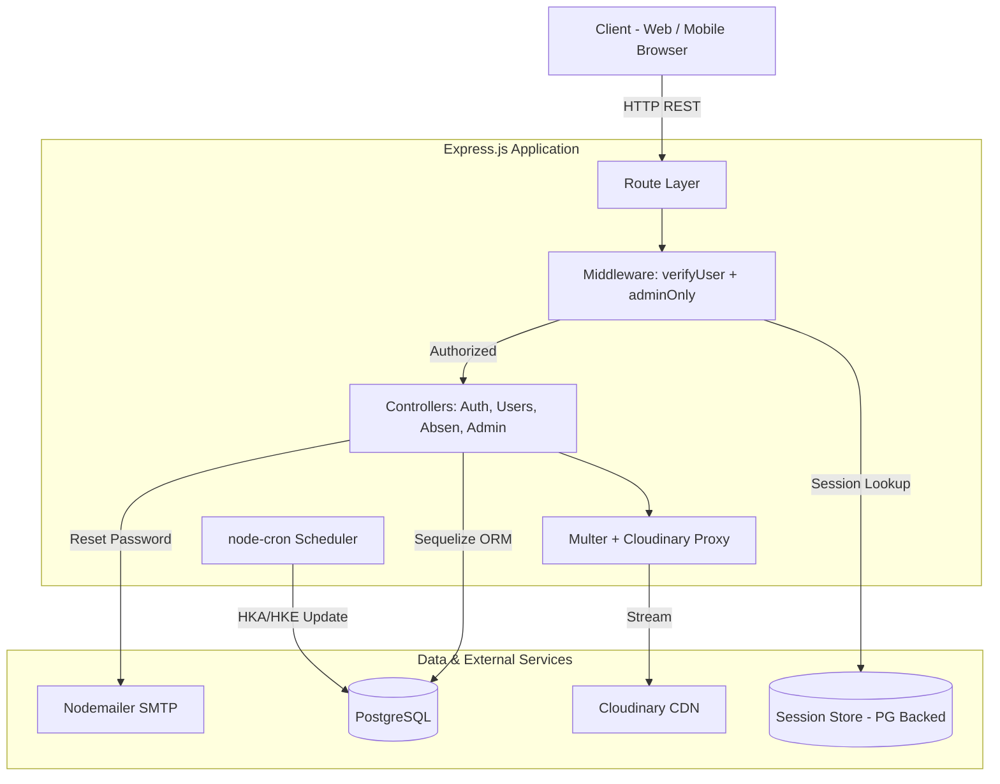

<div align="center">

# Max Samasta — Core Backend API

[](https://github.com/Max-Attendance-Application/Backend-JS/actions/workflows/ci.yml)
[](https://nodejs.org/)
[](https://expressjs.com/)
[](https://www.postgresql.org/)
[](https://sequelize.org/)
[](https://opensource.org/licenses/ISC)

**A high-integrity, geofenced employee attendance and workforce analytics system designed for secure operational tracking and automated metric accumulation.**

Built for internal operations at **[Max Samasta](https://maxgrup.co.id)** — Creative Digital Provider & Agency.

</div>

---

## 📑 Table of Contents
- [System Overview & Key Features](#-system-overview--key-features)
- [System Architecture & Data Flow](#-system-architecture--data-flow)
- [Directory Structure](#-directory-structure)
- [Tech Stack & Engineering Rationale](#-tech-stack--engineering-rationale)
- [Key Engineering Highlights & Trade-offs](#-key-engineering-highlights--trade-offs)
- [Database Schema](#-database-schema)
- [API Reference](#-api-reference)
- [Getting Started](#-getting-started--local-development)
- [Environment Variables](#-environment-variables)
- [Testing & Code Quality](#-testing--code-quality)

---

## 🏗 System Overview & Key Features

The Max Samasta Backend is a monolithic RESTful API built on **Node.js/Express** and backed by **PostgreSQL**. It is engineered to enforce strict physical presence validation for employees while providing administrative capabilities to manage workforce performance metrics (HKA/HKE).

**Key Capabilities:**
- 🌍 **Geospatial Validation:** Implements the Haversine formula at the application layer to enforce a strict 9-meter radius attendance boundary, preventing off-site tap-ins.
- 🛡️ **Role-Based Access Control:** Enforces `admin` and `employee` boundaries via `verifyUser` and `adminOnly` middleware guards. Missing sessions and non-admin access to admin routes are rejected with `401`.
- 🔐 **Stateful Session Management:** Utilizes PostgreSQL-backed sessions (`connect-session-sequelize`) with 2-hour TTL to enable instant server-side session revocation.
- ⚙️ **Automated Workforce Analytics:** `node-cron` jobs increment the monthly Effective Working Days (HKE) nightly and sync Actual Working Days (HKA) to every employee on the 1st of each month; `populateHKAE` seeds per-employee records on server bootstrap.
- ☁️ **Stateless Media Pipeline:** Offloads multipart/form-data image processing (profile photos & attendance selfies) directly to Cloudinary via `multer-storage-cloudinary`.
- 📧 **Email Automation:** Password reset flow via `nodemailer` with time-limited token validation (`resetPasswordToken` + `resetPasswordExpires`).

---

## 📐 System Architecture & Data Flow

The application follows a **Model-View-Controller (MVC)** pattern with middleware-driven cross-cutting concerns.



---

## 📂 Directory Structure

```text
Backend/
├── config/
│   └── Database.js          # Sequelize connection to PostgreSQL
├── controllers/
│   ├── Auth.js              # Login, Logout, Me (session check)
│   ├── Users.js             # CRUD users, profile upload, password reset
│   ├── absen.js             # Tap-in, Tap-out, geofencing logic
│   └── Admin.js             # HKE/HKA records, statistics, date-range queries
├── middleware/
│   ├── AuthUser.js          # verifyUser (session guard) + adminOnly (RBAC)
│   ├── sessionChecker.js    # Session existence checker for /me
│   └── uploadMiddleware.js  # Multer → Cloudinary storage engine
├── models/
│   ├── UserModel.js         # users table (uuid, role, status, password hash)
│   ├── AbsenModel.js        # AbsenModel table (tapin/tapout, coordinates, photo)
│   ├── HKAEModel.js         # HKAE table (HKA, HKE per employee)
│   ├── AdminModel.js        # Admin table (monthly calendar config)
│   └── index.js             # Sequelize CLI boilerplate (not used at runtime)
├── routes/
│   ├── AuthRoute.js         # /login, /logout, /me, /forgot-password, /reset-password
│   ├── UserRoute.js         # /users, /createusersv2, /uploadProfileImage, /suspenduser
│   ├── AbsenRoute.js        # /absen/in, /absen/out, /absen, /absens
│   └── AdminRoute.js        # /admin, /allrecord, /allrecordbydate, /statistics
├── utils/
│   ├── location.js          # Haversine formula (calculateDistance)
│   ├── cronJob.js           # node-cron: nightly HKE increment + monthly HKA sync
│   ├── populateHKAE.js      # Bootstrap HKAE records for existing users
│   └── cloudinary.js        # Cloudinary SDK configuration
├── .github/
│   ├── workflows/ci.yml     # GitHub Actions CI pipeline
│   └── PULL_REQUEST_TEMPLATE.md
├── index.js                 # Application entry point & bootstrap
├── package.json             # Dependencies & scripts (ES Modules)
└── LICENSE                  # ISC License
```

---

## 🛠 Tech Stack & Engineering Rationale

| Component | Technology | Architectural Rationale |
| :--- | :--- | :--- |
| **Runtime** | Node.js 22 LTS (ES Modules) | Non-blocking I/O handles concurrent morning peak attendance requests efficiently. |
| **Framework** | Express.js v4.19 | Minimalist framework enabling granular middleware pipeline customization. |
| **Database** | PostgreSQL v14+ | ACID-compliant relational store for attendance ledger integrity. |
| **ORM** | Sequelize v6.37 | Schema synchronization via `{ alter: true }` and model-level validations. |
| **Session Store** | `express-session` + `connect-session-sequelize` | DB-backed sessions enable instant revocation (suspend/terminate employee). |
| **Password Hash** | Argon2 | Memory-hard hashing resistant to GPU brute-force; superior to bcrypt. |
| **Media Storage** | Cloudinary + `multer-storage-cloudinary` | Direct cloud upload prevents disk I/O bottlenecks on the application server. |
| **Scheduler** | `node-cron` | In-process cron for nightly HKE and monthly HKA updates without an external job runner. |
| **Mailer** | Nodemailer | SMTP-based password reset flow with token expiration. |
| **Timezone** | `moment-timezone` | All timestamps normalized to `Asia/Jakarta` for consistent local reporting. |

---

## 🚀 Key Engineering Highlights & Trade-offs

### 1. Stateful Sessions vs. JWT
**Challenge:** Suspended or terminated employees must be locked out instantly.
**Solution:** Database-backed sessions via `connect-session-sequelize`. Destroying the session row in PostgreSQL instantly invalidates access, unlike JWT which remains valid until expiry.
**Trade-off:** Every authenticated request performs a session lookup plus a user lookup in PostgreSQL, trading some latency and DB load for instant revocation.

### 2. Application-Layer Geofencing
**Challenge:** Validate employee GPS coordinates within a strict 9-meter radius of the office.
**Solution:** Pure JavaScript Haversine formula in `utils/location.js` with hardcoded office coordinates (`lat: -6.577023, lon: 106.810703, radius: 9m`).
**Trade-off:** Avoids PostGIS dependency, keeping the database portable across managed DB services. Minimal CPU overhead since geofencing only runs on `POST /absen/in` and `POST /absen/out`. Office coordinates are hardcoded, so supporting multiple sites requires moving them to config or a table.

### 3. Once-Per-Day Attendance Guard
**Challenge:** Prevent duplicate tap-ins / tap-outs on the same calendar day.
**Solution:** Before writing, the controller queries `AbsenModel` with `Op.between` on `startOfDay` and `endOfDay`. If a record exists, it returns `400 "You can only tap in once per day"`.
**Trade-off:** This is an application-level check-then-insert, not a DB constraint. Two concurrent requests from the same user could both pass the check; a unique index on `(userId, date)` would close that race window.

---

## 🔒 Security Considerations

- **CORS:** Restricted to `process.env.CLIENT_URL` (defaults to `http://localhost:5173`).
- **Cookie Config:** `secure: "auto"` enforces HTTPS in production; 2-hour `maxAge` with automatic session store expiration.
- **Password Storage:** Argon2 hash — never stored in plaintext.
- **Password Exclusion:** User-facing queries never return the hash — user/auth controllers use explicit attribute whitelists, and attendance joins use `attributes: { exclude: ['password'] }`.
- **Input Validation:** Sequelize model-level validators (`isEmail`, `isIn`, `len`, `notEmpty`) enforce data integrity at the ORM layer.

---

## 🗄 Database Schema

All models use `freezeTableName: true` to prevent Sequelize from pluralizing table names.

| Table | Key Columns | Relations |
| :--- | :--- | :--- |
| **`users`** | `uuid`, `name`, `email`, `password` (argon2), `username`, `gender`, `division`, `position`, `role` (admin/employee), `Status` (aktif/suspended), `urlprofile`, `resetPasswordToken`, `resetPasswordExpires` | `hasMany → AbsenModel`, `hasOne → HKAE` |
| **`AbsenModel`** | `id` (PK, auto-increment), `uuid` (UUID), `tapin` (DATE), `tapout` (DATE), `photo` (Cloudinary URL), `userId` (FK), `latitudeTapIn`, `longitudeTapIn`, `latitudeTapOut`, `longitudeTapOut` | `belongsTo → users` |
| **`HKAE`** | `id` (PK), `userId` (FK, unique), `HKA` (Actual Working Days), `HKE` (Effective Working Days) | `belongsTo → users` (1:1) |
| **`Admin`** | `No` (PK), `Tahun`, `Bulan`, `HKA`, `HKE`, `Jumlah`, `TanggalHariLibur` (INTEGER[] of holiday dates) | Standalone — monthly working-day calendar |
| **`Sessions`** | Auto-managed by `connect-session-sequelize` (ephemeral, 2-hour TTL) | Internal |

---

## 📖 API Reference

Full payloads available in the included Postman Collection: [`API Documentation Max Samasta.postman_collection.json`](./API%20Documentation%20Max%20Samasta.postman_collection.json)

### Authentication

| Method | Endpoint | Description | Auth |
| :--- | :--- | :--- | :--- |
| `POST` | `/login` | Authenticate user, create DB session | Public |
| `DELETE` | `/logout` | Destroy session cookie | Session |
| `GET` | `/me` | Return current authenticated user data | Session |
| `POST` | `/forgot-password` | Send reset token via email | Public |
| `POST` | `/reset-password` | Reset password using valid token | Public |

### User Management

| Method | Endpoint | Description | Auth |
| :--- | :--- | :--- | :--- |
| `GET` | `/users` | List all users | Admin |
| `GET` | `/users/:id` | Get user by ID | Admin |
| `POST` | `/createusersv2` | Create user with profile photo | Public |
| `POST` | `/uploadProfileImage` | Upload/update own profile image | Session |
| `PATCH` | `/users/:id` | Update user data | Session |
| `PATCH` | `/suspenduser/:id` | Suspend an employee | Admin |
| `PATCH` | `/aktifuser/:id` | Reactivate suspended employee | Admin |
| `DELETE` | `/users/:id` | Delete user | Admin |

### Attendance (Absensi)

| Method | Endpoint | Description | Auth |
| :--- | :--- | :--- | :--- |
| `POST` | `/absen/in` | Tap-in with photo + GPS (geofenced) | Session |
| `POST` | `/absen/out` | Tap-out with GPS (geofenced) | Session |
| `GET` | `/absen` | Get all attendance records | Admin |
| `GET` | `/absens` | Query attendance with filters (name, date range) | Admin |
| `GET` | `/absen/:id` | Get attendance record by ID | Admin |
| `GET` | `/absenbyname/:name` | Get attendance by employee name | Admin |
| `PATCH` | `/absen/:id` | Update attendance record | Session |
| `DELETE` | `/absen/:id` | Delete attendance record | Session |

### Admin & Workforce Analytics

| Method | Endpoint | Description | Auth |
| :--- | :--- | :--- | :--- |
| `POST` | `/admin` | Create monthly calendar/HKE config | Admin |
| `GET` | `/allrecord` | Get all admin HKA/HKE records | Admin |
| `GET` | `/allrecordbydate` | Query records by year & month | Admin |
| `GET` | `/statistics` | Get workforce statistics | Session |

### Example: Tap-In Request

```bash
curl -X POST http://localhost:3000/absen/in \
  -H "Cookie: connect.sid=s%3AYOUR_SESSION_ID" \
  -F "latitude=-6.577023245193599" \
  -F "longitude=106.81070304025452" \
  -F "photo=@/path/to/selfie.jpg"
```

**Response (201 Created):**
```json
{
  "message": "Tap in successful",
  "data": {
    "id": 1,
    "userId": 5,
    "photo": "https://res.cloudinary.com/xxx/image/upload/absen_photos/abc123",
    "tapin": "2024-07-22T08:00:00+07:00",
    "tapout": null,
    "latitude": "-6.577023245193599",
    "longitude": "106.81070304025452",
    "createdAt": "2024-07-22T08:00:00+07:00",
    "updatedAt": "2024-07-22T08:00:00+07:00"
  }
}
```

---

## ⚙️ Environment Variables

Copy `.env.example` to `.env` and populate:

| Variable | Required | Description | Example |
| :--- | :---: | :--- | :--- |
| `APP_PORT` | ✅ | HTTP server port | `3000` |
| `CLIENT_URL` | ➖ | Allowed CORS origin + base URL for reset-password links (defaults to `http://localhost:5173`) | `http://localhost:5173` |
| `SESS_SECRET` | ✅ | Cryptographic secret for signing session cookies | `my_super_secret` |
| `DB_NAME` | ✅ | PostgreSQL database name | `max_attendance_db` |
| `DB_USER` | ✅ | PostgreSQL role/user | `postgres` |
| `DB_PASSWORD` | ✅ | PostgreSQL password | `your_password` |
| `DB_HOST` | ✅ | PostgreSQL host | `127.0.0.1` |
| `DB_DIALECT` | ✅ | Sequelize dialect | `postgres` |
| `DB_PORT` | ✅ | PostgreSQL port | `5432` |
| `CLOUDINARY_CLOUD_NAME` | ✅ | Cloudinary instance name | `my_cloud` |
| `CLOUDINARY_API_KEY` | ✅ | Cloudinary API key | `123456789` |
| `CLOUDINARY_API_SECRET` | ✅ | Cloudinary API secret | `abc-xyz` |
| `EMAIL_HOST` | ✅ | SMTP host for password-reset emails | `smtp.gmail.com` |
| `EMAIL_PORT` | ✅ | SMTP port | `465` |
| `EMAIL_USER` | ✅ | SMTP username / sender address | `noreply@example.com` |
| `EMAIL_PASS` | ✅ | SMTP password or app password | `app_password` |

---

## 💻 Getting Started & Local Development

### Prerequisites
- Node.js `22 LTS` (CI runs on 22.x and 24.x)
- PostgreSQL `v14` or higher
- Cloudinary account (for media uploads)
- SMTP credentials (for password-reset emails)

### Quick Start
```bash
# Clone & install
git clone https://github.com/Max-Attendance-Application/Backend-JS.git
cd Backend-JS
npm install

# Configure environment
cp .env.example .env
# Edit .env with your database and Cloudinary credentials

# Start server (auto-syncs DB tables on bootstrap)
npm start
```

> **Note:** Ensure PostgreSQL is running before executing `npm start`. The application uses `{ alter: true }` to automatically create and synchronize all tables on startup.

### Production Deployment
```bash
# Using PM2 process manager behind Nginx reverse proxy
pm2 start index.js --name "maxsamasta-api" --env production
```

---

## 🧪 Testing & Code Quality

| Tool | Command | Purpose |
| :--- | :--- | :--- |
| **Postman** | Import `API Documentation Max Samasta.postman_collection.json` | End-to-end API integration testing |
| **npm audit** | `npm audit` | Dependency vulnerability scanning |
| **GitHub Actions** | Auto-triggered on push/PR to `main` | CI pipeline: install + security audit |

---

*Architected and maintained by [Hasan Abdurrahman](https://www.linkedin.com/in/hasan-abdurrahman).*
